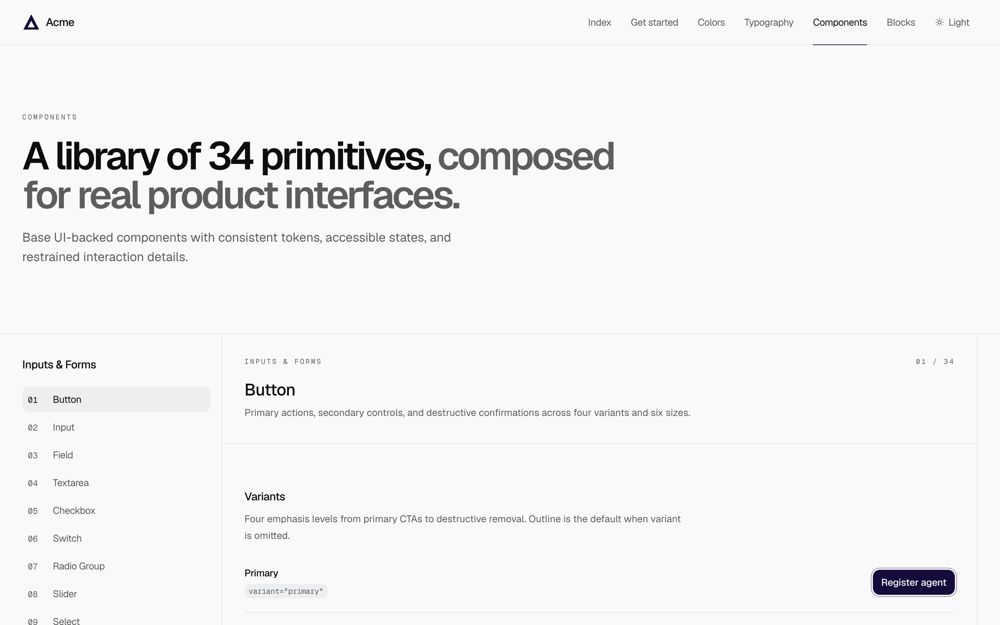

# Acme Design System

A shadcn-compatible registry of 34 accessible primitives built on Base UI, Tailwind v4 and OKLCH tokens.

**[Live docs →](https://acme-design-system-psi.vercel.app)**



## Install

Register the namespace once, then add anything by name:

```bash
pnpm dlx shadcn@latest registry add @acme=https://acme-design-system-psi.vercel.app/r/{name}.json

pnpm dlx shadcn@latest add @acme/button
pnpm dlx shadcn@latest add @acme/all
```

Every primitive pulls in `base` (Geist fonts, theme tokens, base CSS and `cn`). Wire up your own theme provider for dark mode — see [Get started](https://acme-design-system-psi.vercel.app/integrate).

### Bundles

| Item         | Installs                                                          |
| ------------ | ----------------------------------------------------------------- |
| `essentials` | button, input, textarea, field, badge, card, separator, spinner   |
| `forms`      | form and selection controls                                       |
| `overlays`   | dialog, sheet, drawer, popover, tooltip, menu, command, accordion |
| `data`       | navigation, status, tables, progress, charts                      |
| `media`      | audio player and animated feedback                                |
| `all`        | every primitive                                                   |

### Opt-in

These write project files, so they're never installed implicitly:

| Item             | Writes                                                       |
| ---------------- | ------------------------------------------------------------ |
| `design`         | `DESIGN.md`                                                  |
| `project-config` | `AGENTS.md`, `.oxlintrc.json`, `.oxfmtrc.json`, `.gitignore` |
| `logo`           | `Logo` component                                             |
| `favicons`       | `public/favicon.svg`, `public/favicon-dark.svg`              |

## Development

```bash
pnpm install
pnpm test
pnpm lint
```

There's no CI yet, so run `pnpm test` and `pnpm lint` before committing.

| Concern           | File                                |
| ----------------- | ----------------------------------- |
| Components        | `src/components/ui/*`               |
| Tokens            | `src/styles.css`                    |
| Registry payloads | `src/registry/items.ts`             |
| Docs catalog      | `src/registry/component-catalog.ts` |
| Invariant tests   | `src/registry/registry.test.ts`     |

Registry routes: `/r/{name}.json` for items, `/r/registry.json` for the index. Inside the repo, imports use `#/components/ui/*` and `#/lib/cn`; payloads rewrite them to `@/components/ui/*` and `@/lib/utils`.

### Adding a component

1. Write `src/components/ui/{name}.tsx`.
2. In `src/registry/items.ts`, add a `?raw` import and a `registry:ui` item, then add it to `uiItems` and any bundles.
3. To document it, add a `component-catalog.ts` entry (`name` must match the item `title`), a route at `src/routes/components/{id}.tsx` and a preview at `src/routes/components/-docs/previews/{id}-preview.tsx`. For dependency-only items, add the name to `registryOnlyUiItems` instead.
4. Run `pnpm test`, which checks most of this, and `pnpm lint`.
